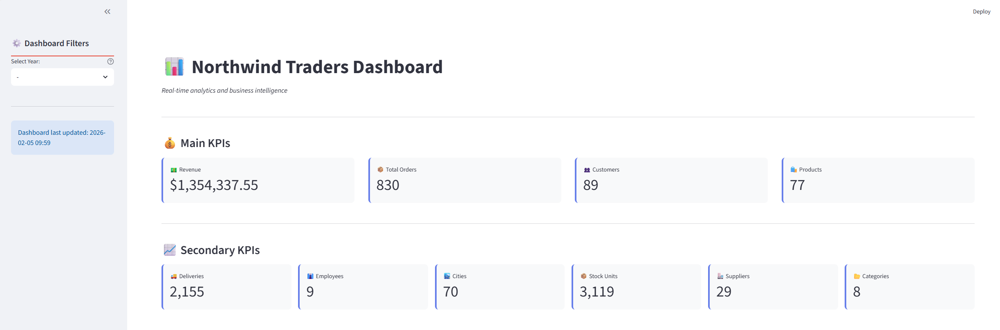
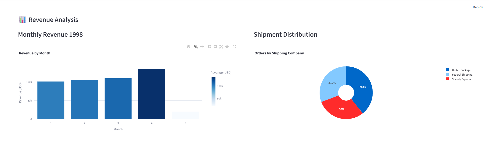
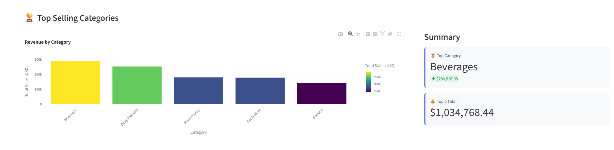

# Northwind Traders Dashboard

An interactive dashboard developed with **Streamlit** and **Python** for analyzing data from the Northwind database.

## 📋 Description

This project provides a modern web application that connects to a **SQL Server** database (Northwind) and presents visual analyses and statistics about:

- **Products**: Number of products, categories, suppliers, and units in stock
- **Orders**: Number of orders, customers, employees, cities, and countries
- **Revenue**: Revenue analysis and sales details
- **Trends**: Charts and data visualizations over time

## 🛠️ Technologies Used

- **Streamlit** - Framework for creating interactive web applications
- **Python 3.x** - Programming language
- **Pandas** - Data manipulation and analysis
- **SQLAlchemy** - ORM and SQL toolkit
- **Plotly Express** - Interactive visualizations
- **PyODBC** - SQL Server connectivity
- **NumPy** - Numerical computing
- **Matplotlib** - Complementary visualizations

## 📦 Installation

### Prerequisites

- Python 3.7+
- SQL Server with Northwind database configured
- Pip (Python package manager)

### Steps

1. **Clone the repository**
   ```bash
   git clone https://github.com/your-username/python-streamlit.git
   cd python-streamlit
   ```

2. **Create a virtual environment** (recommended)
   ```bash
   python -m venv .venv
   ```

3. **Activate the virtual environment**
   
   On Windows (PowerShell):
   ```powershell
   .\.venv\Scripts\Activate.ps1
   ```
   
   On Windows (CMD):
   ```cmd
   .venv\Scripts\activate.bat
   ```
   
   On Linux/macOS:
   ```bash
   source .venv/bin/activate
   ```

4. **Install dependencies**
   ```bash
   pip install -r requirement.txt
   ```

5. **Configure the database connection**
   
   Edit the `app.py` file and update the SQL Server credentials:
   ```python
   connection_string = "DRIVER={ODBC Driver 17 for SQL Server};SERVER=your-server;DATABASE=Northwind;UID=your-user;PWD=your-password"
   ```

## 🚀 Running the Application

```bash
streamlit run app.py
```

The application will automatically open in your browser at `http://localhost:8501`

## 📁 Project Structure

```
python-streamlit/
├── app.py                 # Main application with the dashboard
├── northwind.ipynb       # Jupyter Notebook with exploratory analyses
├── requirement.txt       # Project dependencies
├── README.md            # This file
└── images/
    ├── main-dash.png             # Main KPIs screenshot
    ├── revenue-dash.png          # Revenue analysis screenshot
    └── top-selling-dash.png      # Top categories screenshot
```

## 📊 Features

### Main Dashboard (`app.py`)

- **Key Indicators (KPIs)**: Real-time cards displaying main metrics
  - Revenue (in USD)
  - Total Orders
  - Customers
  - Products
  - Deliveries, Employees, Cities, Stock Units, Suppliers, and Categories

- **Interactive Charts**: Beautiful visualizations powered by Plotly
  - Monthly Revenue Analysis (Bar Charts)
  - Shipment Distribution (Pie Charts)
  - Top Selling Categories with detailed metrics
  
- **Professional UI**: Modern design with custom styling
  - Responsive layout
  - Currency formatting for all monetary values
  - Emoji icons for better visual identification
  - Dark-friendly color scheme

#### Dashboard Screenshots

**Main KPIs Overview**


**Revenue Analysis Section**


**Top Selling Categories**


### Exploratory Notebook (`northwind.ipynb`)

Contains additional analyses and data exploration with Jupyter Notebook, including:
- Data loading and cleaning
- Statistical analyses
- Exploratory visualizations

## 🔧 Database Configuration

This project uses the **Northwind** database from SQL Server. Make sure you have:

1. SQL Server installed and running
2. Northwind database restored
3. User and password configured correctly

> **Note:** The dashboard displays data from the Northwind sample database, including products, orders, customers, and suppliers from the years 1996-1998.

## 📝 Environment Variables (Optional)

For better security, you can use environment variables instead of hardcoding credentials:

```python
import os
from dotenv import load_dotenv

load_dotenv()

connection_string = os.getenv("DATABASE_URL")
```

## 🐛 Troubleshooting

### Error: "ODBC Driver 17 for SQL Server not found"
- Install the Microsoft ODBC Driver 17 for SQL Server

### Database connection error
- Verify that SQL Server is running
- Confirm access credentials
- Test the connection with SQL Server Management Studio

### Streamlit won't start
- Verify that all dependencies are installed
- Try reinstalling: `pip install --upgrade streamlit`

## 📚 Additional Resources

- [Streamlit Documentation](https://docs.streamlit.io/)
- [SQLAlchemy Documentation](https://docs.sqlalchemy.org/)
- [Plotly Documentation](https://plotly.com/python/)
- [Northwind Database](https://github.com/Microsoft/sql-server-samples)

## 📄 License

This project is provided as is for educational and demonstration purposes.

## 🤝 Contributing

Contributions are welcome! Feel free to:
- Report bugs or issues
- Suggest new features
- Improve documentation
- Submit pull requests

## ✉️ Contact

For questions or suggestions, open an issue in the repository.

---

**Developed with ❤️ using Streamlit and Python**
*Last Updated: February 5, 2026*
